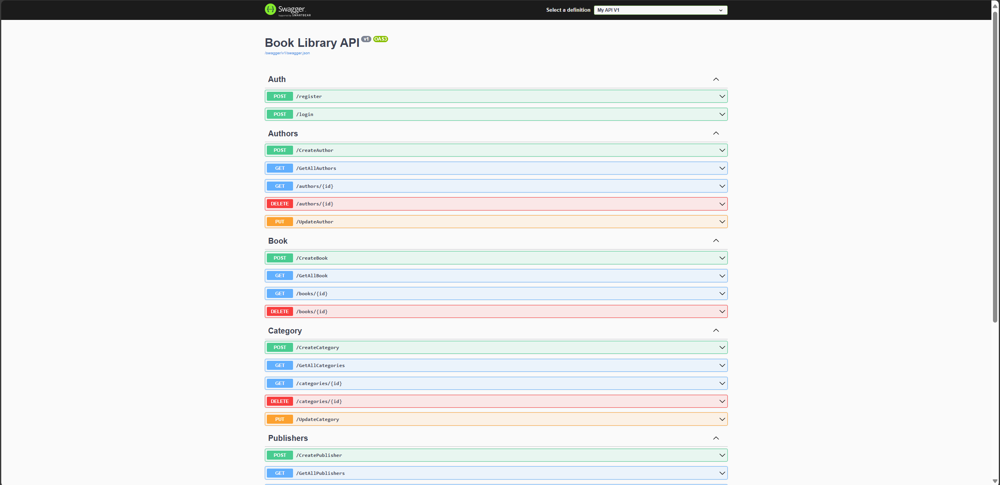

# MLSA Ghana 2024 - BookLibraryAPIDemo

This is a demo project for the Microsoft Learn Student Ambassadors (MLSA) Ghana 2024 event. It's a RESTful API built with ASP.NET Core for managing a book library.

## Features

- Manage books, authors, categories, and publishers.
- Implement authorization and authentication.
- Use Swagger for API documentation.

## Getting Started

### Prerequisites

- .NET Core 8.0
-  SQL Server

